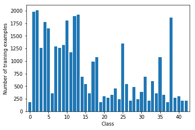
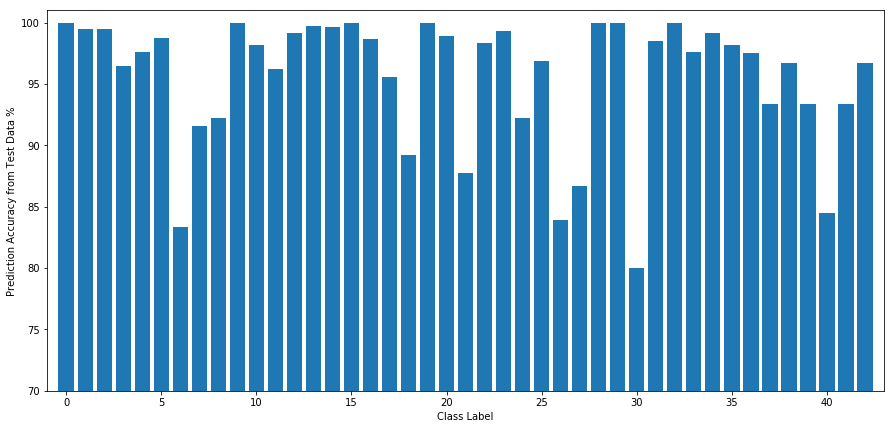

## Traffic Sign Classifier Project

### I. Data Set Summary & Exploration

#### 1. Basic summary of the data set.

The code for this step is contained in the second code cell of the IPython notebook.  
I used the pandas library to calculate summary statistics of the traffic signs data set:  

* Number of training examples = 34799
* Number of validation examples = 4410
* Number of testing examples = 12630
* Image data shape = 32 x 32 x 3
* Number of classes = 43

#### 2. Exploratory visualization of the dataset.  

The code for this step is contained in the third code cell of the IPython notebook.  

Here is the histogram of the data set:  

Here we can see that the sample is not uniformly distributed. 

### II. Design and Test a Model Architecture

#### 1. Data Preprocessing 

The code for this step is contained in the 4th to 7th code cell of the IPython notebook.  

The preprocessing step includes converting from RGB to grayscale and normalize the image data.  

I decided to convert the images to grayscale because color is not a decisive factor for recognizing a traffic sign. A speed limit sign should be recognizable either in grayscale or color.
In addition, using only 1 channel of the image data reduce the data size by 70% and makes the training process easier and faster.  
Here is an example of a traffic sign image before and after grayscaling and normalization:  

#### 2. Training, Validation and Testing data

The data set has separate training, validation and testing data. There is no need to split the data further.

#### 3. Model Architecture

The code for my final model along with some helper functions is located in  
the 8th to 17th code cell of the ipython notebook. 

My final model consisted of the following layers:

| Layer         		|     Description	        					| 
|:---------------------:|:---------------------------------------------:| 
| Input         		| 32x32x1 grayscale image   					| 
| Convolution 5x5     	| 1x1 stride, padding: SAME, output: 32x32x32 	|
| Max pooling	      	| None, output: 32x32x32 	 			        |
| Convolution 5x5	    | 1x1 stride, padding: VALID, output: 28x28x48  |
| Max pooling		    | 2x2, output: 14x14x48        					|
| Convolution 5x5		| 1x1 stride, padding: VALID, output: 10x10x64  |
| Max pooling			| 2x2, output: 5x5x64							|
| Flattened		        | output: 1600									|
| Fully connected 1     | output: 128                                   |
| RELU                  |                                               |
| Fully connected 2     | output: 64                                    |
| RELU                  |                                               |
| Dropout               | keep probability: 0.5                         |
| Fully connected 3     | output: 43                                    |
 

#### 4. Model Training

Model training is located in the 18th code cell of the jupyter notebook.  
Model testing is located in the 19th code cell of the jupyter notebook.  
The training is minimizing the cross entropy with adam optimizer.  
Epochs: 10  
Batch size: 128  
Optimizer: Adam optimizer with learning rate 0.001  

#### 5. Solution

The code for calculating the accuracy of the model is located in the 19th and 20th cell of the Ipython notebook.

My final model results were:
* validation set accuracy of 98.6% 
* test set accuracy of 96.7%

Solution approach:
* The first architecture that was tried is LeNet
* The validation accuracy was 94% and the accuracy on the new test image was only 50%
* Adjustment includes adding an extra convolutional layer, adding number of filters in the convolutional layer,  
  adding extra neurons to the fully connected layer, and applying dropout to the fully connected layer.  
  The details of the architecture is in \#3 Model Architecture.
* The final model achieved validation accuracy of 98.6%, test accuracy of 96.7% and new image accuracy of 80%.
 
##### Here is the result of the prediction on test data:

Class 0 class count: 60, correctly predicted: 60, accuracy: 100.00%  
Class 1 class count: 720, correctly predicted: 716, accuracy: 99.44%  
Class 2 class count: 750, correctly predicted: 746, accuracy: 99.47%  
Class 3 class count: 450, correctly predicted: 434, accuracy: 96.44%  
Class 4 class count: 660, correctly predicted: 644, accuracy: 97.58%  
Class 5 class count: 630, correctly predicted: 622, accuracy: 98.73%  
Class 6 class count: 150, correctly predicted: 125, accuracy: 83.33%  
Class 7 class count: 450, correctly predicted: 412, accuracy: 91.56%  
Class 8 class count: 450, correctly predicted: 415, accuracy: 92.22%  
Class 9 class count: 480, correctly predicted: 480, accuracy: 100.00%  
Class 10 class count: 660, correctly predicted: 648, accuracy: 98.18%  
Class 11 class count: 420, correctly predicted: 404, accuracy: 96.19%  
Class 12 class count: 690, correctly predicted: 684, accuracy: 99.13%  
Class 13 class count: 720, correctly predicted: 718, accuracy: 99.72%  
Class 14 class count: 270, correctly predicted: 269, accuracy: 99.63%  
Class 15 class count: 210, correctly predicted: 210, accuracy: 100.00%  
Class 16 class count: 150, correctly predicted: 148, accuracy: 98.67%  
Class 17 class count: 360, correctly predicted: 344, accuracy: 95.56%  
Class 18 class count: 390, correctly predicted: 348, accuracy: 89.23%  
Class 19 class count: 60, correctly predicted: 60, accuracy: 100.00%  
Class 20 class count: 90, correctly predicted: 89, accuracy: 98.89%  
Class 21 class count: 90, correctly predicted: 79, accuracy: 87.78%  
Class 22 class count: 120, correctly predicted: 118, accuracy: 98.33%  
Class 23 class count: 150, correctly predicted: 149, accuracy: 99.33%  
Class 24 class count: 90, correctly predicted: 83, accuracy: 92.22%  
Class 25 class count: 480, correctly predicted: 465, accuracy: 96.88%  
Class 26 class count: 180, correctly predicted: 151, accuracy: 83.89%  
Class 27 class count: 60, correctly predicted: 52, accuracy: 86.67%  
Class 28 class count: 150, correctly predicted: 150, accuracy: 100.00%  
Class 29 class count: 90, correctly predicted: 90, accuracy: 100.00%  
Class 30 class count: 150, correctly predicted: 120, accuracy: 80.00%  
Class 31 class count: 270, correctly predicted: 266, accuracy: 98.52%  
Class 32 class count: 60, correctly predicted: 60, accuracy: 100.00%  
Class 33 class count: 210, correctly predicted: 205, accuracy: 97.62%  
Class 34 class count: 120, correctly predicted: 119, accuracy: 99.17%  
Class 35 class count: 390, correctly predicted: 383, accuracy: 98.21%  
Class 36 class count: 120, correctly predicted: 117, accuracy: 97.50%  
Class 37 class count: 60, correctly predicted: 56, accuracy: 93.33%  
Class 38 class count: 690, correctly predicted: 667, accuracy: 96.67%  
Class 39 class count: 90, correctly predicted: 84, accuracy: 93.33%  
Class 40 class count: 90, correctly predicted: 76, accuracy: 84.44%  
Class 41 class count: 60, correctly predicted: 56, accuracy: 93.33%  
Class 42 class count: 90, correctly predicted: 87, accuracy: 96.67%  

### III. Test a Model on New Images

#### 1. Test the model on 10 new traffic sign images.

Here are ten German traffic signs that I found on the web:

#### 2. Prediction on new traffic sign images

The code for making predictions on my final model is located in the 21st to 23rd cell of the Ipython notebook.

Here are the results of the prediction:

The model was able to correctly guess 8 of the 10 traffic signs, which gives an accuracy of 80%.  
This compares favorably to the accuracy on the test set of 96.70%.  
The sign that my model failed to predict is #28 Children Crossing because the childrens in the image from 
the new data set are facing the opposite way from the image in the training data set.  
Although predicted incorrectly, the prediction is pretty close to Children Crossing, it is predicted as
Bicycle Crossing and Right of way at the next intersection.  

#### 3. Softmax probabilities for each prediction of new traffic sign images

The code for making predictions on my final model is located in the 24th cell of the Ipython notebook.

Here is the result:

### IV. Conclusion
The model achieved a pretty good performance of predicting the test data set with 96.70% accuracy, and new data set with 80% accuracy.
I believe the model could be improved with data augmentation (flipping, rotation, etc).  
If data augmentation were performed, I believe the model would accurately predict the flipped #28 (Children crossing) sign from the new data set, making the accuracy on the new data set to 100%.  
